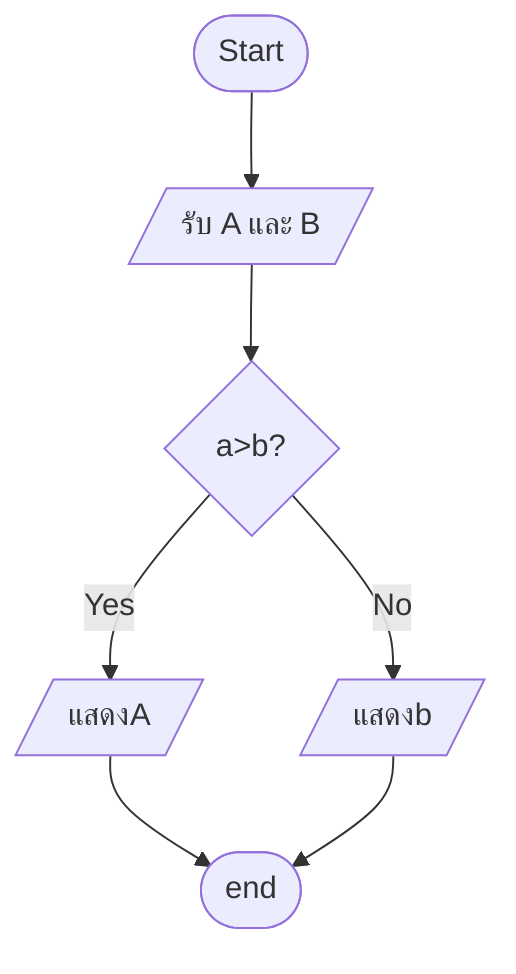
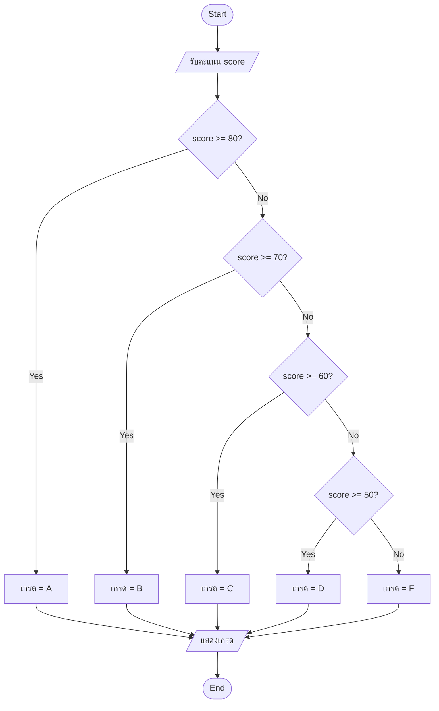
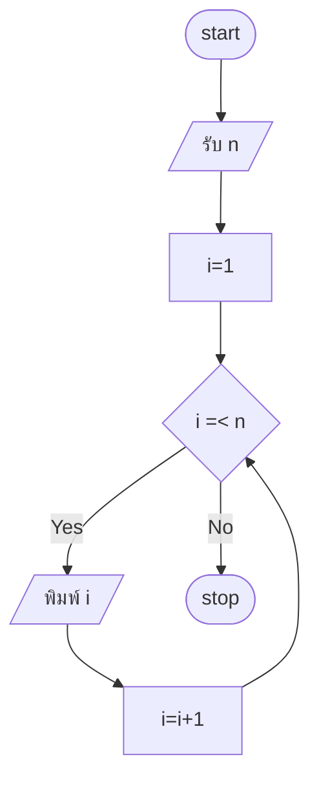

```mermaid
flowchart TD
start([Start]) --> input[/รับ A และ B/]
input --> check{a>b?}
check -- Yes --> ab[/แสดงA/]
check -- No --> ba[/แสดงb/]
ab --> e([end])
ba --> e
```

```mermaid
flowchart TD
Start([Start]) --> Input[/รับคะแนน score/]
Input --> D1{score >= 80?}
D1 -->|Yes| A[เกรด = A]
D1 -->|No| D2{score >= 70?}
D2 -->|Yes| B[เกรด = B]
D2 -->|No| D3{score >= 60?}
D3 -->|Yes| C[เกรด = C]
D3 -->|No| D4{score >= 50?}
D4 -->|Yes| D[เกรด = D]
D4 -->|No| F[เกรด = F]
A & B & C & D & F --> Output[/แสดงเกรด/]
Output --> End([End])
```

```mermaid
flowchart TD
start([start]) --> input[/รับ n/]
input --> process[i=1]
process --> check{i =< n}
check --Yes --> print[/พิมพ์ i/]
check --No --> stop([stop])
print --> i[i=i+1] --> check
```
