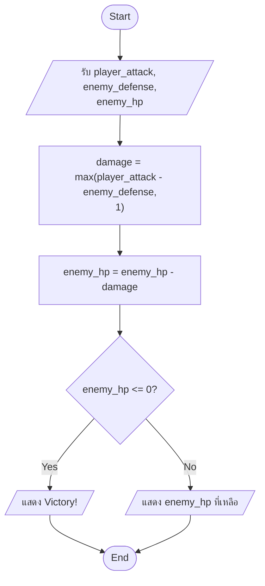
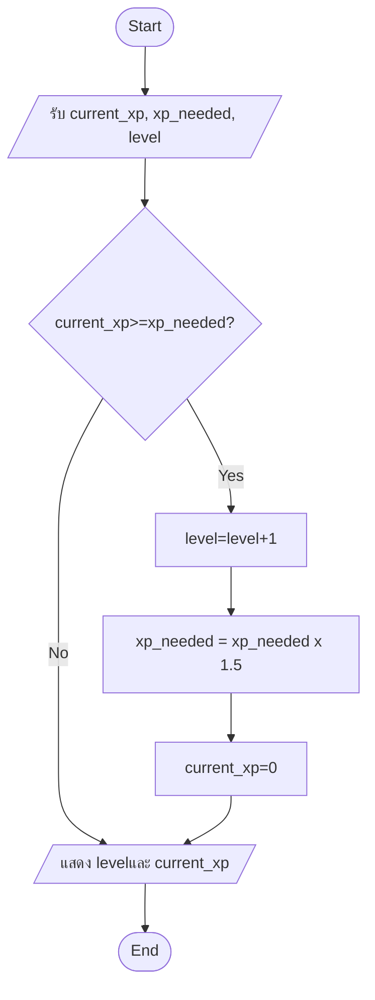
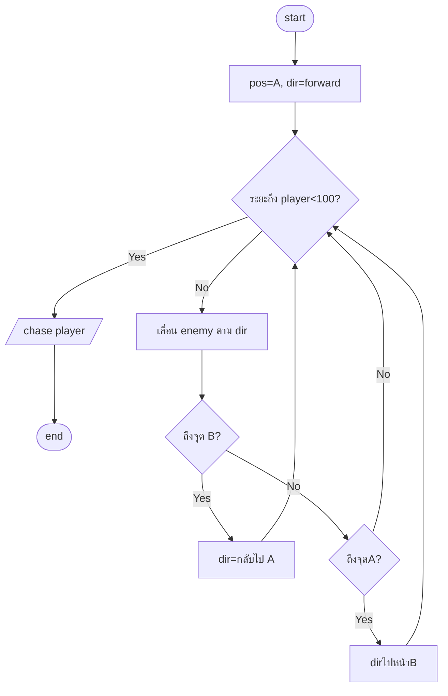

โจทย์ A

```mermaid
flowchart TD
Start([Start]) --> Input[/รับ player_attack, enemy_defense,
enemy_hp/]
Input --> Calc["damage = max(player_attack - enemy_defense,
1)"]
Calc --> Reduce["enemy_hp = enemy_hp - damage"]
Reduce --> D1{enemy_hp <= 0?}
D1 -->|Yes| Win[/แสดง Victory!/]
D1 -->|No| Show[/แสดง enemy_hp ที่เหลือ/]
Win & Show --> End([End])
```

โจทย์ B

```mermaid
flowchart TD
Start([Start]) --> Input[/รับ current_xp, xp_needed, level/]
Input --> check{current_xp>=xp_needed?}
check --Yes --> calc["level=level+1"]
check --No --> output[/แสดง levelและ current_xp/]
calc --> calc2["xp_needed = xp_needed x 1.5"]
calc2 --> calc3["current_xp=0"] --> output
output --> en([End])
```

```mermaid
flowchart TD
start([start]) --> po["pos=A, dir=forward"]
po --> check{ระยะถึง player<100?}
check --Yes --> chase[/chase player/] --> en([end])
check --No --> pu["เลื่อน enemy ตาม dir"] --> to{ถึงจุด B?}
to --Yes --> di["dir=กลับไป A"] --> check
to --No --> go{ถึงจุดA?}
go --Yes --> dir[dirไปหน้าB] --> check
go --No --> check
```
